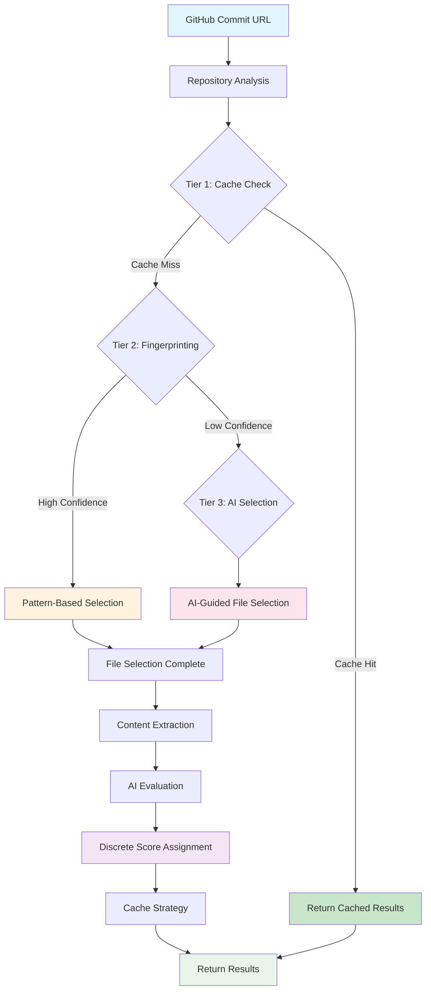
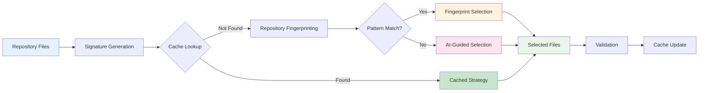
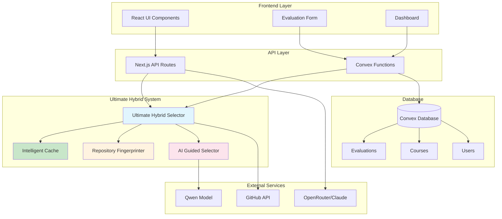
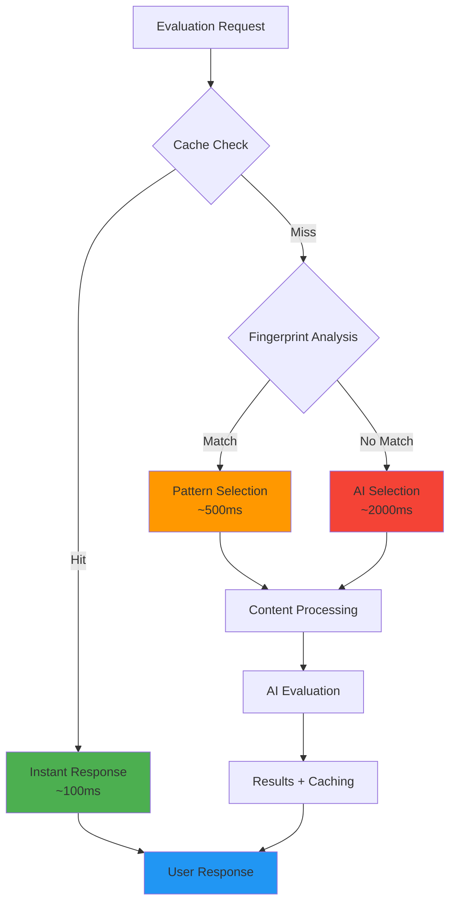

# ZoomJudge - AI-Powered Repository Evaluation Platform

[](https://zoomjudge.com)
[](https://nextjs.org/)
[](https://www.typescriptlang.org/)
[](https://convex.dev)
[](https://vercel.com)
[](https://opensource.org/licenses/MIT)

> **AI-powered GitHub repository evaluation platform for Zoomcamp courses**  
> Get instant feedback on your Data Engineering, ML, MLOps, LLM, and Stock Markets projects with intelligent scoring and detailed analysis.

## 🚀 Overview

ZoomJudge is a production-ready web application that provides AI-powered evaluation of GitHub repositories specifically designed for Zoomcamp course participants. Submit your GitHub commit URL, select your course type, and receive detailed feedback with numerical scoring based on course-specific criteria.

### ✨ Core Features

- **🎯 GitHub Commit Analysis**: Evaluates repositories at specific commit points using commit URLs
- **📚 Multi-Course Support**: Data Engineering, Machine Learning, MLOps, LLM Zoomcamp, and Stock Markets
- **🤖 AI-Powered Feedback**: Detailed scoring and recommendations using GLM-4.5-Air with Claude fallback
- **💳 Subscription Tiers**: Free (4 evals/month), Starter ($12 - 20 evals), Pro ($20 - 200 evals), Enterprise (unlimited)
- **📊 Real-time Dashboard**: Track evaluation history, view detailed results, and monitor usage
- **🔐 Secure Authentication**: Complete user management with Clerk authentication and billing
- **📱 Responsive Design**: Mobile-optimized interface with dark/light theme support

## 🏗️ Application Architecture

### Tech Stack & Structure

ZoomJudge is built as a modern full-stack web application with the following architecture:

#### **Frontend Layer**
- **Framework**: Next.js 15 with App Router and server components
- **UI Components**: shadcn/ui with Radix UI primitives
- **Styling**: TailwindCSS v4 with responsive design
- **Animations**: Framer Motion and GSAP for smooth interactions
- **State Management**: React hooks with Convex real-time subscriptions

#### **Backend Services**
- **Database**: Convex serverless database with real-time sync
- **Authentication**: Clerk with complete user management
- **AI Processing**: Integration with OpenRouter and Claude for evaluations
- **File Processing**: GitHub API integration for repository analysis
- **Billing**: Clerk Billing with subscription management

#### **Core Workflow**
1. **User Authentication**: Secure login via Clerk
2. **Repository Submission**: Paste GitHub commit URL + select course
3. **Billing Validation**: Check subscription limits and tier access
4. **AI Evaluation**: Process repository using evaluation service
5. **Results Display**: Real-time results with detailed breakdown
6. **History Tracking**: Store evaluations for future reference

### Ultimate Hybrid Evaluation System

ZoomJudge employs the **Ultimate Hybrid Evaluation System**, a sophisticated three-tier architecture that combines intelligent caching, repository fingerprinting, and AI-guided selection for optimal performance and accuracy.

#### Ultimate Hybrid Evaluation Flow



#### File Selection Process



#### Component Interaction Architecture



#### Performance Optimization Flow


### 🛡️ Evaluation System

#### Course-Specific Criteria
- **Data Engineering**: Infrastructure, pipelines, data warehousing, cloud usage
- **Machine Learning**: EDA, model training, deployment, monitoring, reproducibility
- **MLOps**: Workflow orchestration, CI/CD, monitoring, automation
- **LLM Zoomcamp**: RAG systems, evaluation, prompt engineering
- **Stock Markets**: Trading strategies, backtesting, risk management

#### Intelligent Repository Analysis
- **GitHub Integration**: Fetches repository structure and content via GitHub API
- **File Selection**: Intelligent filtering to focus on relevant project files
- **Content Processing**: Extracts and analyzes code, documentation, and configuration
- **AI Scoring**: Uses GLM-4.5-Air model with Claude Sonnet 4 as fallback
- **Caching System**: Avoids duplicate evaluations for identical commits

## 🎯 Subscription & Billing

### Pricing Tiers

| Tier | Price | Evaluations/Month | Features |
|------|-------|------------------|----------|
| **Free** | $0 | 4 | Basic scoring only, community support |
| **Starter** | $12 | 20 | Full scoring + LLM feedback, detailed analysis, PDF export (planned) |
| **Pro** | $20 | 200 | Advanced analytics (planned), comparison tools (planned), priority processing (planned), API access (planned) |
| **Enterprise** | Custom | Unlimited | Team collaboration (planned), custom criteria (planned), bulk processing (planned), dedicated support |

### Subscription Management

- **Clerk Billing Integration**: Seamless subscription management and payment processing
- **Usage Tracking**: Real-time monitoring of evaluation counts and limits
- **Automatic Limits**: Billing gates prevent exceeding subscription limits
- **Upgrade Prompts**: Contextual upgrade suggestions when approaching limits
- **Invoice Management**: Automated billing and invoice generation

## 🔧 Technology Stack

### Frontend
- **Framework**: Next.js 15 with App Router
- **Language**: TypeScript with strict configuration
- **Styling**: TailwindCSS v4
- **UI Components**: shadcn/ui + Radix UI
- **Animations**: Framer Motion + GSAP
- **Icons**: Lucide React + Tabler Icons
- **Charts**: Recharts for data visualization

### Backend & Services
- **Database**: Convex (real-time serverless)
- **Authentication**: Clerk (auth + billing)
- **AI Services**: OpenRouter with GLM-4.5-Air (Claude fallback)
- **File Storage**: GitHub API integration
- **Email**: Resend for transactional emails
- **Webhooks**: Svix for secure webhook handling
- **Rate Limiting**: Upstash Redis (optional)

### Development & Deployment
- **Package Manager**: Bun
- **Build Tool**: Turbopack (Next.js)
- **Deployment**: Vercel
- **Testing**: Jest + Testing Library
- **Linting**: ESLint + TypeScript
- **Version Control**: Git + GitHub

## 📊 Dashboard Features

### User Dashboard
- **Overview Stats**: Total evaluations, completed, in progress, average scores
- **Quick Actions**: Fast access to create new evaluations
- **Usage Tracking**: Monitor monthly evaluation limits and subscription status
- **Billing Alerts**: Notifications when approaching limits or requiring upgrades

### Evaluation Management
- **History View**: Complete list of all past evaluations with filtering
- **Detailed Results**: Comprehensive breakdown by evaluation criteria
- **Performance Charts**: Visual representation of scores and trends (planned)
- **Export Options**: PDF export for detailed reports (planned for paid tiers)

### Admin Features
- **Email Management**: Monitor delivery rates and email campaigns
- **User Analytics**: Track platform usage and user engagement
- **System Health**: Monitor platform performance and uptime
- **Course Management**: Configure evaluation criteria and scoring

## 🚀 Getting Started

### For Users

1. **Sign Up**: Create a free account at [ZoomJudge.com](https://zoomjudge.com)
2. **Choose Course**: Select your Zoomcamp course type
3. **Submit Repository**: Paste your GitHub commit URL
4. **Get Results**: Receive detailed feedback and scoring
5. **Track Progress**: Monitor your evaluation history and improvement

### For Developers

#### Prerequisites
- **Node.js 18+** and **Bun** package manager
- **Convex** account for database
- **Clerk** account for authentication
- **OpenRouter** API key for AI evaluations
- **GitHub** token for repository access

#### Local Development Setup

1. **Clone and install:**
   ```bash
   git clone <repository-url>
   cd zoomjudge
   bun install
   ```

2. **Environment setup:**
   ```bash
   cp .env.example .env.local
   # Edit .env.local with your API keys
   ```

3. **Database initialization:**
   ```bash
   bunx convex dev
   bun run init-db
   ```

4. **Start development:**
   ```bash
   bun run dev
   ```

5. **Access application:**
   ```
   http://localhost:3000
   ```

## 🔌 Key Features

### Evaluation Flow

1. **Repository Input**: Users paste GitHub commit URLs for consistent evaluation
2. **Course Selection**: Choose from 5 supported Zoomcamp courses
3. **Billing Validation**: Check subscription limits before processing
4. **AI Analysis**: Repository analyzed using GLM-4.5-Air with Claude fallback
5. **Detailed Results**: Comprehensive scoring with criterion breakdown
6. **History Tracking**: All evaluations saved for future reference

### Core Components

#### Evaluation Form (`/dashboard/new-evaluation`)
- GitHub commit URL validation
- Course type selection (visual buttons)
- Real-time form validation with Zod schemas
- Billing limit warnings and upgrade prompts
- Mobile-responsive design

#### Results Display
- Overall score with percentage
- Criterion-by-criterion breakdown
- Source file references for each criterion
- Detailed feedback and improvement suggestions
- Export options (planned for paid subscribers)

#### Dashboard Analytics
- Usage statistics (total, completed, processing)
- Monthly limit tracking
- Score trends and performance charts (planned)
- Recent evaluation history

#### Admin Panel
- Email campaign management
- User analytics and platform metrics
- System health monitoring
- Course criteria configuration

## 🧪 Testing & Quality Assurance

### Comprehensive Test Suite

- **Unit Tests**: 32 tests covering core functionality
- **Integration Tests**: End-to-end evaluation workflows  
- **Edge Case Tests**: Large repositories, missing files, network failures
- **Performance Tests**: Load testing and benchmark validation
- **Security Tests**: Authentication, input validation, rate limiting

### Test Commands

```bash
# Run all tests
bun run test

# Watch mode for development
bun run test:watch

# Coverage report
bun run test:coverage

# Specific test suites
bun run test:email
bun run test:email-service

# Debug file selection
bun run debug:file-selection
```

### Quality Metrics

- **Code Coverage**: > 90%
- **Type Safety**: 100% TypeScript coverage
- **Security**: Regular security audits and dependency updates
- **Performance**: Continuous monitoring and optimization

## 🔒 Security & Compliance

### Security Features

- **Authentication**: JWT-based authentication via Clerk
- **Authorization**: Role-based access control with billing integration
- **Input Validation**: Comprehensive sanitization with Zod schemas
- **Rate Limiting**: Redis-based rate limiting to prevent abuse
- **Audit Logging**: Complete security event tracking
- **Data Protection**: PII sanitization and secure data handling

### Privacy & Data Handling

- **Repository Analysis**: Static analysis only, no persistent storage of code
- **User Data**: GDPR-compliant data handling
- **API Keys**: Secure storage and rotation
- **Webhook Security**: Signed webhook verification with Svix

## 📈 Usage Guide

### For Students

#### Getting Your Commit URL
1. Go to your GitHub repository
2. Navigate to the "Commits" section
3. Click on your specific commit
4. Copy the URL from your browser
5. Format: `https://github.com/username/repo/commit/hash`

#### Submitting for Evaluation
1. **Login** to ZoomJudge dashboard
2. **Navigate** to "New Evaluation"
3. **Paste** your GitHub commit URL
4. **Select** your course type
5. **Submit** and wait for results

#### Understanding Your Results
- **Overall Score**: Total points out of maximum possible
- **Criterion Breakdown**: Detailed scoring per evaluation area
- **Feedback**: Specific recommendations for improvement
- **Source Files**: Which files were analyzed for each criterion

### For Instructors

#### Course Configuration
- Each course has specific evaluation criteria
- Scoring rubrics are pre-configured
- Results provide consistent, objective assessment
- Detailed feedback helps guide student improvement

#### Bulk Evaluation (Planned for Enterprise)
- Enterprise tier will support bulk processing
- API access for automated workflows (planned)
- Custom criteria configuration (planned)
- Team collaboration features (planned)

## 🛠️ Development

### Development Scripts

```bash
# Development server with Turbopack
bun run dev

# Production build
bun run build

# Start production server  
bun run start

# Linting and quality checks
bun run lint
bun run check-criteria

# Database operations
bun run init-db
bunx convex dev
bunx convex deploy

# Bundle analysis
bun run build:analyze
```

### Project Structure

```
├── app/                    # Next.js App Router
│   ├── api/               # API routes
│   ├── dashboard/         # Protected dashboard
│   └── (landing)/         # Landing page
├── components/            # React components
│   ├── ui/               # shadcn/ui components
│   └── feedback/         # Feedback system
├── convex/               # Backend functions
│   ├── schema.ts         # Database schema
│   ├── evaluations.ts    # Evaluation logic
│   └── users.ts          # User management
├── lib/                  # Core libraries
│   ├── ultimate-hybrid/  # Hybrid architecture
│   ├── config/          # Configuration
│   ├── validation/      # Input validation
│   └── utils/           # Utilities
├── hooks/               # React hooks
└── public/              # Static assets
```

### Contributing Guidelines

1. **Development Setup**: Follow installation guide
2. **Code Standards**: TypeScript strict mode, ESLint compliance
3. **Testing**: Add tests for new features
4. **Documentation**: Update README and inline comments
5. **Performance**: Consider impact on evaluation speed
6. **Security**: Follow security best practices

## 🚀 Deployment

### Vercel Deployment (Recommended)

1. **Connect Repository** to Vercel
2. **Configure Environment Variables** in Vercel dashboard
3. **Deploy**: Automatic deployment on push to main

### Environment Variables for Production

```bash
# Core Services
CONVEX_DEPLOYMENT=prod:your-deployment
NEXT_PUBLIC_CONVEX_URL=https://your-deployment.convex.cloud
NEXT_PUBLIC_CLERK_PUBLISHABLE_KEY=pk_live_...
CLERK_SECRET_KEY=sk_live_...

# AI & External APIs
OPENROUTER_API_KEY=sk-or-...
GITHUB_TOKEN=ghp_...

# Optional Services
UPSTASH_REDIS_REST_URL=https://...
UPSTASH_REDIS_REST_TOKEN=...
```

### Production Optimizations

- **Edge Caching**: Automatic static asset optimization
- **Image Optimization**: Next.js automatic image optimization  
- **Bundle Analysis**: Optimized bundle splitting
- **Performance Monitoring**: Real-time metrics and alerting
- **Error Tracking**: Comprehensive error monitoring

## 🔮 Roadmap & Future Enhancements

### Near-term
- [ ] **PDF Export Implementation**: Complete PDF generation for evaluation reports
- [ ] **Advanced Analytics Dashboard**: Performance charts and trend analysis
- [ ] **API Access**: RESTful API for Pro and Enterprise tiers
- [ ] **Comparison Tools**: Side-by-side evaluation comparison

### Medium-term
- [ ] **Team Collaboration**: Organization and team management features
- [ ] **Custom Criteria**: User-defined evaluation criteria
- [ ] **Priority Processing**: Faster evaluation for paid tiers
- [ ] **Mobile App**: Native mobile application

### Long-term
- [ ] **Bulk Processing**: Multiple repository evaluation for Enterprise
- [ ] **AI Model Fine-tuning**: Custom models for specific course types
- [ ] **Integration Ecosystem**: GitHub App, VS Code extension
- [ ] **Enterprise Features**: SSO, advanced security, custom deployment

## 📄 License & Support

### License
This project is licensed under the **MIT License**. See [LICENSE](LICENSE) file for details.

### Support Channels

- **Documentation**: Comprehensive guides and API documentation
- **GitHub Issues**: Bug reports and feature requests
- **Community**: GitHub Discussions for community support
- **Enterprise**: Dedicated support for enterprise customers

### Acknowledgments

- **Zoomcamp Community**: Course content and evaluation criteria
- **OpenRouter**: Access to state-of-the-art AI models
- **Convex**: Real-time database and serverless infrastructure
- **Clerk**: Authentication and billing platform
- **Vercel**: Hosting and deployment optimization

---

**ZoomJudge** - Revolutionizing repository evaluation with AI-powered analysis and intelligent caching.  
Built for the modern developer workflow with performance, accuracy, and user experience at its core.

*Built with ❤️ using Next.js 15, TypeScript, Convex, Clerk, and the Ultimate Hybrid Architecture.*