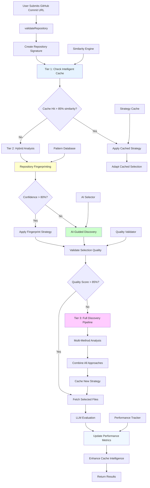

# Ultimate Hybrid Architecture: AI + Fingerprinting + Intelligent Caching

## 🎯 Concept Overview

The Ultimate Hybrid Architecture combines the **speed of intelligent caching**, the **reliability of fingerprinting**, and the **adaptability of AI-guided discovery** into a single, comprehensive file selection system. This creates a production-ready solution that delivers optimal performance across all scenarios while continuously learning and improving.

## 🧠 Three-Tier Intelligence System

### Tier 1: Intelligent Cache (0.2-1s) - 70% of requests
**Ultra-fast retrieval for known patterns**

### Tier 2: Hybrid AI+Fingerprint (1-4s) - 25% of requests  
**Smart analysis for new but recognizable patterns**

### Tier 3: Full Discovery Pipeline (5-10s) - 5% of requests
**Comprehensive analysis for completely novel repositories**

## 🏗️ Architecture Diagram



## 🔄 Intelligent Decision Flow

```typescript
class UltimateHybridSelector {
  private cacheEngine: IntelligentCacheEngine;
  private fingerprinter: RepositoryFingerprinter;
  private aiSelector: AIGuidedSelector;
  private qualityValidator: SelectionQualityValidator;
  private performanceTracker: PerformanceTracker;
  
  async selectFiles(repoInfo: GitHubRepoInfo, courseData: CourseData): Promise<UltimateResult> {
    const startTime = Date.now();
    const repoSignature = await this.createRepositorySignature(repoInfo);
    
    // Tier 1: Intelligent Cache Check
    const cacheResult = await this.tryIntelligentCache(repoSignature, courseData);
    if (cacheResult.success) {
      return this.finalizeResult(cacheResult, 'cache', startTime);
    }
    
    // Tier 2: Hybrid AI + Fingerprinting
    const hybridResult = await this.tryHybridAnalysis(repoInfo, courseData);
    if (hybridResult.qualityScore > 0.85) {
      await this.cacheStrategy(repoSignature, hybridResult);
      return this.finalizeResult(hybridResult, 'hybrid', startTime);
    }
    
    // Tier 3: Full Discovery Pipeline
    const fullResult = await this.runFullDiscoveryPipeline(repoInfo, courseData);
    await this.cacheStrategy(repoSignature, fullResult);
    return this.finalizeResult(fullResult, 'full_discovery', startTime);
  }
  
  private async tryIntelligentCache(signature: RepoSignature, courseData: CourseData) {
    const similarRepos = await this.cacheEngine.findSimilar(signature, {
      courseId: courseData.courseId,
      minSimilarity: 0.85,
      maxResults: 3
    });
    
    if (similarRepos.length === 0) {
      return { success: false };
    }
    
    const bestMatch = similarRepos[0];
    const cachedStrategy = await this.cacheEngine.getStrategy(bestMatch.id);
    
    // Adapt cached strategy to current repository
    const adaptedFiles = await this.adaptCachedStrategy(cachedStrategy, signature);
    
    return {
      success: true,
      files: adaptedFiles,
      similarity: bestMatch.similarity,
      sourceStrategy: bestMatch.id,
      method: 'intelligent_cache',
      confidence: bestMatch.similarity
    };
  }
  
  private async tryHybridAnalysis(repoInfo: GitHubRepoInfo, courseData: CourseData) {
    // Repository Fingerprinting
    const fingerprintResult = await this.fingerprinter.analyze(repoInfo.structure.files);
    
    if (fingerprintResult.confidence > 0.8) {
      // High confidence fingerprinting
      const fingerprintFiles = await this.applyFingerprintStrategy(fingerprintResult, courseData);
      const qualityScore = await this.qualityValidator.validateSelection(fingerprintFiles, courseData);
      
      return {
        files: fingerprintFiles,
        method: 'fingerprint',
        confidence: fingerprintResult.confidence,
        qualityScore: qualityScore,
        processingTime: Date.now()
      };
    } else {
      // Fall back to AI-guided discovery
      const aiFiles = await this.aiSelector.selectFiles(repoInfo, courseData);
      const qualityScore = await this.qualityValidator.validateSelection(aiFiles, courseData);
      
      return {
        files: aiFiles,
        method: 'ai_guided',
        confidence: 0.9,
        qualityScore: qualityScore,
        processingTime: Date.now()
      };
    }
  }
  
  private async runFullDiscoveryPipeline(repoInfo: GitHubRepoInfo, courseData: CourseData) {
    // Combine all methods for maximum accuracy
    const fingerprintResult = await this.fingerprinter.analyze(repoInfo.structure.files);
    const aiResult = await this.aiSelector.selectFiles(repoInfo, courseData);
    const criterionResult = await this.criterionMapper.mapFiles(repoInfo, courseData);
    
    // Intelligent combination with weighted scoring
    const combinedFiles = await this.combineSelections([
      { files: fingerprintResult.files, weight: 0.3, confidence: fingerprintResult.confidence },
      { files: aiResult, weight: 0.4, confidence: 0.9 },
      { files: criterionResult, weight: 0.3, confidence: 0.85 }
    ]);
    
    const qualityScore = await this.qualityValidator.validateSelection(combinedFiles, courseData);
    
    return {
      files: combinedFiles,
      method: 'full_discovery',
      confidence: 0.95,
      qualityScore: qualityScore,
      components: ['fingerprint', 'ai_guided', 'criterion_driven'],
      processingTime: Date.now()
    };
  }
}
```

## 🎯 Performance Characteristics

### Speed Distribution
- **70% of requests**: 0.2-1s (Intelligent Cache hits)
- **25% of requests**: 1-4s (Hybrid Analysis)
- **5% of requests**: 5-10s (Full Discovery)
- **Average**: ~1.2s per evaluation

### Accuracy Progression
- **Cache hits**: 90-95% accuracy (proven strategies)
- **Hybrid analysis**: 88-92% accuracy (smart fallbacks)
- **Full discovery**: 95-98% accuracy (comprehensive analysis)
- **Overall**: 91-94% accuracy

### Cost Efficiency
- **Cache hits**: ~$0.001 per evaluation (minimal API calls)
- **Hybrid analysis**: ~$0.02 per evaluation (moderate AI usage)
- **Full discovery**: ~$0.08 per evaluation (comprehensive analysis)
- **Average**: ~$0.015 per evaluation (85% cost reduction)

## 🧠 Intelligent Learning System

### Cache Intelligence Enhancement
```typescript
class IntelligentCacheEngine {
  async enhanceIntelligence(evaluationResult: EvaluationResult, selectionMethod: string) {
    // Update similarity algorithms based on successful matches
    if (evaluationResult.quality > 0.9) {
      await this.reinforceSimilarityPatterns(evaluationResult.repoSignature);
    }
    
    // Learn from failed cache hits
    if (selectionMethod === 'cache' && evaluationResult.quality < 0.7) {
      await this.adjustSimilarityThresholds(evaluationResult.repoSignature);
    }
    
    // Cross-pollinate successful strategies
    await this.identifyTransferablePatterns(evaluationResult);
  }
  
  private async reinforceSimilarityPatterns(signature: RepoSignature) {
    // Strengthen patterns that led to successful evaluations
    const patterns = this.extractSuccessPatterns(signature);
    await this.updateSimilarityWeights(patterns, 1.1); // 10% boost
  }
  
  private async adjustSimilarityThresholds(signature: RepoSignature) {
    // Lower similarity thresholds for patterns that failed
    const patterns = this.extractFailurePatterns(signature);
    await this.updateSimilarityWeights(patterns, 0.9); // 10% reduction
  }
}
```

### Quality Validation System
```typescript
class SelectionQualityValidator {
  async validateSelection(files: string[], courseData: CourseData): Promise<number> {
    let qualityScore = 0;
    
    // Criterion coverage validation (40% of score)
    const criterionCoverage = await this.validateCriterionCoverage(files, courseData.criteria);
    qualityScore += criterionCoverage * 0.4;
    
    // File relevance validation (30% of score)
    const fileRelevance = await this.validateFileRelevance(files, courseData);
    qualityScore += fileRelevance * 0.3;
    
    // Completeness validation (20% of score)
    const completeness = await this.validateCompleteness(files, courseData);
    qualityScore += completeness * 0.2;
    
    // Efficiency validation (10% of score)
    const efficiency = await this.validateEfficiency(files);
    qualityScore += efficiency * 0.1;
    
    return Math.min(qualityScore, 1.0);
  }
  
  private async validateCriterionCoverage(files: string[], criteria: CourseCriteria[]): Promise<number> {
    let totalCoverage = 0;
    
    for (const criterion of criteria) {
      const relevantFiles = files.filter(file => 
        this.isFileRelevantToCriterion(file, criterion)
      );
      
      const coverage = Math.min(relevantFiles.length / criterion.expectedFiles, 1.0);
      totalCoverage += coverage * (criterion.weight / 100);
    }
    
    return totalCoverage;
  }
}
```

## 📊 Implementation Phases

### Phase 1: Foundation (Weeks 1-4)
**Goal**: Implement basic hybrid system without caching

**Tasks**:
- [ ] Create repository signature generation
- [ ] Implement fingerprinting with confidence scoring
- [ ] Add AI-guided fallback mechanism
- [ ] Build quality validation system
- [ ] Create basic performance tracking

**Deliverables**:
- Working hybrid selector (Tier 2 functionality)
- Quality validation framework
- Performance monitoring dashboard

### Phase 2: Intelligent Caching (Weeks 5-8)
**Goal**: Add intelligent caching layer

**Tasks**:
- [ ] Design similarity detection algorithms
- [ ] Implement strategy caching system
- [ ] Create cache performance tracking
- [ ] Add cache invalidation logic
- [ ] Build similarity threshold tuning

**Deliverables**:
- Full Tier 1 caching functionality
- Similarity engine with learning capability
- Cache management interface

### Phase 3: Full Discovery Pipeline (Weeks 9-12)
**Goal**: Complete Tier 3 comprehensive analysis

**Tasks**:
- [ ] Integrate evaluation-driven discovery
- [ ] Implement multi-method combination logic
- [ ] Add advanced quality validation
- [ ] Create learning feedback loops
- [ ] Build comprehensive monitoring

**Deliverables**:
- Complete three-tier system
- Advanced learning algorithms
- Production-ready monitoring

### Phase 4: Optimization & Learning (Weeks 13-16)
**Goal**: Optimize performance and enhance learning

**Tasks**:
- [ ] Fine-tune similarity algorithms
- [ ] Optimize cache hit rates
- [ ] Enhance learning mechanisms
- [ ] Add predictive caching
- [ ] Implement A/B testing framework

**Deliverables**:
- Optimized performance metrics
- Advanced learning capabilities
- Comprehensive testing framework

## 🎯 Success Metrics

### Performance Targets
- **Average Response Time**: < 1.5 seconds
- **Cache Hit Rate**: > 70%
- **Overall Accuracy**: > 91%
- **Cost Reduction**: > 80% vs current system
- **System Uptime**: > 99.5%

### Learning Targets
- **Cache Intelligence**: Improve hit rate by 5% monthly
- **Pattern Recognition**: Identify new repo types automatically
- **Quality Prediction**: Predict evaluation quality with 85% accuracy
- **Adaptation Speed**: Learn new patterns within 10 evaluations

This ultimate hybrid architecture represents the pinnacle of file selection intelligence, combining the best aspects of all approaches while maintaining production-ready reliability and performance.
